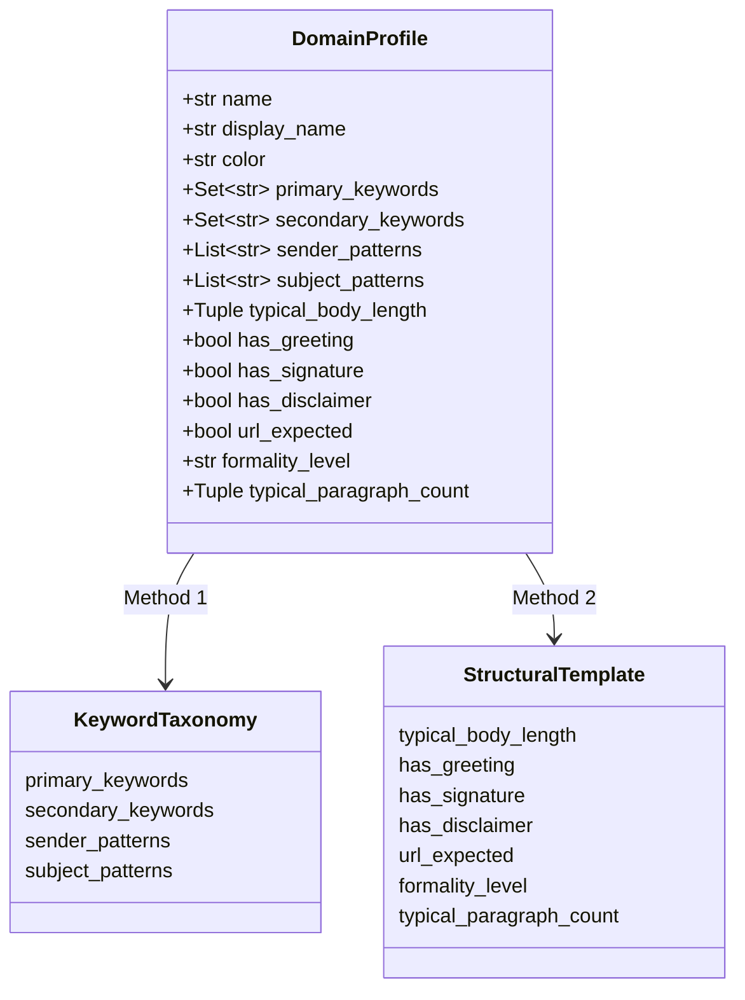
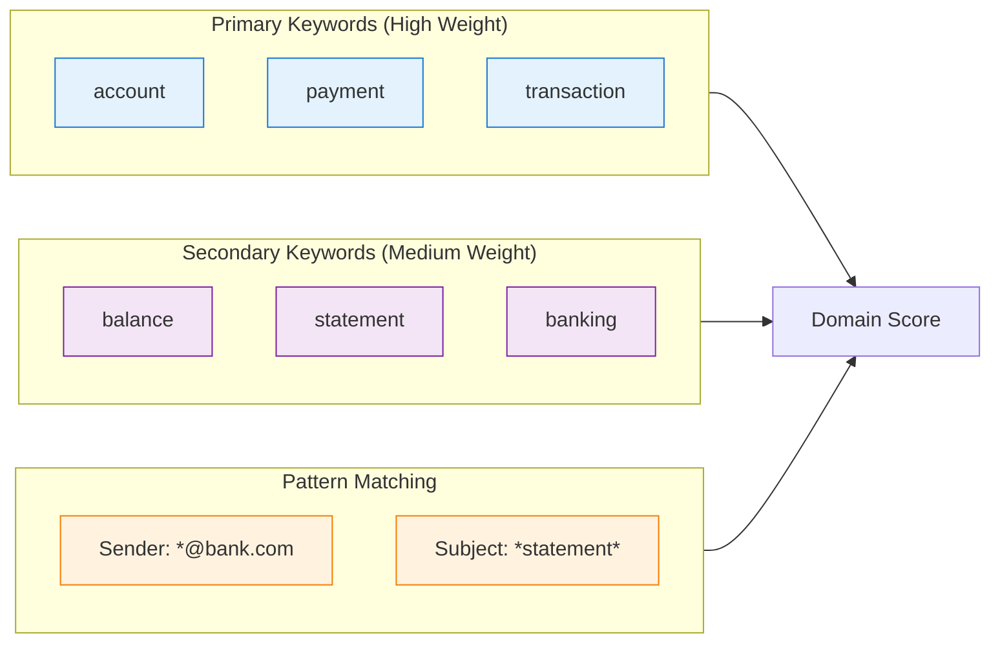

# Design: Domain Profiles

This document describes the domain profile system used for email classification.
It starts with the definition of what a correct domain is, which every classifier,
labeler and evaluation in this project uses.

## Domain definition

**Status:** Proposed — pending owner sign-off (issue #15). Merging the pull request
that adds this section is the sign-off; overrides belong in its review.

The CEAS_08 `label` column says only whether an email is phishing/spam (`1`) or
legitimate (`0`). Nothing in the data records which domain is correct, so this
section fixes the meaning of "domain" for hand-labeling (#16), the TypeSafe Choice
question (#17) and evaluation (#19).

### The definition

**An email's domain is the sector the email claims to come from: the business
sector of the organization it presents itself as, whether or not that claim is
true.** This is the "claimed (impersonated) sector" option. For a legitimate email
the claimed sector is the real sender's sector; for a phishing or spam email it is
the sector being impersonated or pretended.

Apply these rules in order and stop at the first one that gives an answer:

1. **Claimed organization.** If the subject or body names or brands the
   organization the email is from (a bank, a shop, a pharmacy, a carrier, a
   university, a job board, a software project), the answer is that
   organization's sector, except where the jobs rule below says `hr`.
2. **What is sold or asked.** If no organization is claimed, the answer is the
   sector of the product or service the email sells, or of the action it asks the
   reader to take (log in to a bank, pay a delivery fee, apply for a job).
3. **`none`.** If rules 1–2 give no sector from the list, or the claimed sector is
   not on the list (news, entertainment, gambling, lotteries, adult content,
   dating, religion, politics, market research, personal conversation), the
   answer is `none`.

Three rules say how to find the sector in rules 1 and 2. The jobs rule overrides
rule 1:

- **Jobs are `hr`, whatever the employer's sector.** A job offer, job posting or
  recruiter message, and an employer's message to its own staff about pay,
  benefits, leave or employment, are `hr` even when the employer is a bank,
  software company, university or hospital. This overrides rule 1: the employer
  named in a job offer does not decide the answer.
- **Sellers are classified by what they sell.** A shop, reseller or "store" whose
  goods belong to a sector below takes that sector: medicines, pills, supplements
  and other products taken for health, sexual performance or weight loss →
  `healthcare`; software and licences → `technology`; loans, credit, debt relief
  and investments → `finance`; degrees, diplomas and courses → `education`; phone
  and internet plans → `telecommunications`; jobs → `hr`. Only shops selling
  physical consumer goods (watches, clothing, jewellery, electronics, household
  goods) are `retail`.
- **Mailing lists, forums and job boards are classified by what their messages are
  about:** a software project's development list or bug tracker → `technology`;
  any job board or job list, including one run by a software project → `hr`; a
  research list or conference announcement → `education`; a list on a subject
  outside the ten sectors → `none`.

Evidence and tie-breaks:

- **The subject and body decide.** Use the sender's display name or address only
  when the subject and body give no sector. The body wins over a misleading
  subject.
- **Ignore evidence that spam fakes or hijacks:** random or unrelated sender
  addresses (for example `dwteasm@teas.sk`), hijacked legitimate addresses (a
  university or hospital address sending pill spam), link hostnames (spam is often
  hosted on free services such as `spaces.live.com`), and random filler text added
  to beat spam filters.
- **Two sectors mentioned:** the claimed organization wins, except under the jobs
  rule (a PayPal message about an eBay purchase is `finance`; a bank's job offer is
  `hr`). If no organization is claimed, pick the sector of the main call to action.
- **The phishing/legitimate label never changes the answer.** A fake bank email is
  `finance` exactly like a real one.
- **Answer `none` only when no listed sector fits.** Doubt between two listed
  sectors is settled by the tie-breaks above, not by answering `none`.

### Ruling on pharma spam

**Pharma spam classified as `healthcare` is correct.** Emails selling prescription
drugs, "Rx" discounts, erectile-dysfunction or enlargement pills, weight-loss pills
or supplements, or presenting themselves as an online pharmacy or chemist, are
`healthcare` whatever their label (rules 1 and 2 with the seller rule). `retail` is
wrong for them.
Sexual or dating content that names no pill, medicine or other product to take is
`none`.

### Per-domain scope

| Domain | Includes | Excludes (and where it goes) |
|--------|----------|------------------------------|
| `finance` | Banks, credit cards, payment services (PayPal, Western Union), loans, mortgages, debt relief, investments and stock tips, non-health insurance, fund-transfer (advance-fee) offers that are not job offers | Health insurance (`healthcare`); tax authorities (`government`); lotteries, casinos (`none`); job offers, including "financial representative" or payment-processing jobs (`hr`) |
| `technology` | Software companies, webmail and online-account providers that are not phone or internet carriers, cloud and hosting, antivirus, discounted or OEM software, software projects' development lists and bug trackers | Job offers from software companies and job lists run by software projects (`hr`); phone carriers and internet providers (`telecommunications`); social networks (`social_media`); electronics sold by a shop (`retail`) |
| `retail` | Shops and marketplaces (Amazon, eBay, web stores) for physical consumer goods: orders, receipts, returns, promotions, replica watches, clothing, jewellery, electronics, cosmetics | Medicines and pills (`healthcare`); software (`technology`); loans (`finance`); degrees (`education`); parcel tracking sent by a carrier (`logistics`) |
| `logistics` | Carriers and couriers (UPS, FedEx, DHL, postal services): tracking, delivery failure, redelivery, freight, customs fees charged by a courier | Order or shipping confirmations sent by a shop (`retail`) |
| `healthcare` | Hospitals, doctors, clinics, pharmacies including online pharmacies and "chemists", medicines, pills, supplements and "formulas" taken for health, sexual performance or weight loss, lab results, health insurance | Sexual or dating content that names no product to take (`none`); fitness equipment and cosmetics sold by a shop (`retail`); job postings and staff employment messages at a hospital or clinic (`hr`) |
| `government` | Tax authorities (IRS, HMRC), courts, police, customs agencies, licences, permits, benefits agencies | Political campaigns and parties (`none`); courier customs fees (`logistics`) |
| `hr` | An employer's personnel messages to its own staff (payroll, benefits, leave, reviews, onboarding, policies) and recruiting: job boards and job lists (including those run by software projects), job postings and job offers in any industry (including from banks, software companies, universities and hospitals), recruiter outreach, work-from-home job offers | Training courses (`education`); get-rich schemes that are not a job (`finance` if an investment, else `none`) |
| `telecommunications` | Mobile carriers, phone, internet and cable providers: bills, plans, SIM, devices sold by the carrier, calling cards, webmail and account messages from a phone or internet carrier | Webmail and online accounts from providers that are not phone or internet carriers (`technology`) |
| `social_media` | Notifications from a social network about the reader's account there: friend or follow requests, messages, comments, tags, profile and security alerts (Facebook, MySpace, Twitter, LinkedIn) | Mailing lists and discussion lists (by their subject, e.g. `technology`); news digests and newsletters (`none` unless the publisher is in a listed sector); web forums and bulletin boards (by subject, else `none`); dating and adult sites (`none`); e-cards and personal email (`none`) |
| `education` | Universities, schools, online courses, degrees and diploma offers, academic conferences, calls for papers, journals, research mailing lists | Job postings and staff employment messages at a university (`hr`) |
| `none` | News outlets and newsletters, entertainment, gambling, casinos and lotteries, adult content and dating, religion, politics, charities, market-research surveys, personal conversation, empty or unreadable bodies with no sector in the subject or sender name | — |

### Worked examples

Examples marked *CEAS_08* are real rows (sender, subject, a body excerpt and the
output file the current pipeline put them in). Examples marked *illustrative* are
typical cases written for this document.

| # | Email | Label | Current file | Correct domain | Why |
|---|-------|-------|--------------|----------------|-----|
| 1 | *CEAS_08.* "Splendid Rx Joy" — "Extraordinary RX Reductions", link on `spaces.live.com` | 1 | `email_unsure.csv` | `healthcare` | Sells medicines (rule 2, seller rule); link host ignored |
| 2 | *CEAS_08.* "It will rise faster and stay up longer." — "Your one and only online Chemist." | 1 | `email_unsure.csv` | `healthcare` | Claims to be a chemist (rule 1) |
| 3 | *CEAS_08.* "Massage techniques to help your man pole" — "…as long as you pop 2 pills a day" | 1 | `email_unsure.csv` | `healthcare` | Body names pills; body wins over subject |
| 4 | *CEAS_08.* "Never agree to be a loser" — "your troubles caused by small dimension will soon be over! Become a lover…" | 1 | `email_unsure.csv` | `none` | Sexual promise, no pill or product named |
| 5 | *CEAS_08.* "Change your weakness to power" — "Usage of this formula accounts for many great achievements in love!" plus filler text about the SEC Act of 1934 | 1 | `email_finance.csv` | `healthcare` | Sells a "formula" to take (seller rule); filler text ignored |
| 6 | *CEAS_08.* From `linda.groah@kp.org`: "check out, medication safe and effective" | 1 | `email_healthcare.csv` | `healthcare` | Sells medication; the hijacked health-insurer address is not the reason — from any address the answer is the same |
| 7 | *CEAS_08.* "debt consolidation" — "Legally ELIMINATE your credit card and other unsecured debt" | 1 | `email_finance.csv` | `finance` | Sells debt relief (rule 2) |
| 8 | *CEAS_08.* "CNN.com Daily Top 10" — "THE DAILY TOP 10 from CNN.com, Top videos and stories" | 1 | `email_social_media.csv` | `none` | Claims a news outlet; news is not on the list (rule 3). The phishing label does not change this |
| 9 | *CEAS_08.* From `issues.apache.org`: "[Bug 5780] URI processing turns uuencoded strings into http URI's…" | 0 | `email_finance.csv`, `email_social_media.csv`, `email_technology.csv` | `technology` | Bug tracker of a software project (list rule) |
| 10 | *CEAS_08.* From Perl Jobs: "[Perl Jobs] Web Application Developer (LAMP, Perl, Healthcare)" | 0 | `email_healthcare.csv` | `hr` | A job posting (jobs rule) on a job board, even one run by a software project (list rule); the employer's healthcare industry does not matter |
| 11 | *CEAS_08.* "ACNielsen Your Voice * 150 e-points for survey completion" — body is only "This email contains HTML that cannot be displayed" | 0 | `email_unsure.csv` | `none` | Market-research panel; not a listed sector |
| 12 | *CEAS_08.* From `Aschsoft Inc <cghighway@cityofpasadena.net>`: "Local Area Employee Searching Notice" — "Aschsoft Inc fast growing software-in-order company is opening positions of Regional Manager…" | 1 | `email_government.csv` | `hr` | A job offer (jobs rule); the software-company employer, the unrelated government-looking sender address and the phishing label do not matter |
| 13 | *Illustrative.* "Your PayPal account has been limited — log in to restore access" | 1 | — | `finance` | Claims PayPal, a payment service |
| 14 | *Illustrative.* "Question from eBay member about item #1234" | 1 | — | `retail` | Claims a marketplace |
| 15 | *Illustrative.* "Rolex replicas at 90% off" | 1 | — | `retail` | Shop for physical goods (seller rule) |
| 16 | *Illustrative.* "Adobe Photoshop CS3 for $69, instant download" | 1 | — | `technology` | Seller of software (seller rule) |
| 17 | *Illustrative.* "UPS: we could not deliver your parcel, open the attached label" | 1 | — | `logistics` | Claims a carrier |
| 18 | *Illustrative.* "IRS: you are eligible for a tax refund of $189" | 1 | — | `government` | Claims a tax authority |
| 19 | *Illustrative.* "Get a university degree in 2 weeks, no exams" | 1 | — | `education` | Sells degrees (seller rule) |
| 20 | *Illustrative.* "You have a new friend request on Facebook" | 0 or 1 | — | `social_media` | Account notification from a social network |
| 21 | *Illustrative.* "Online casino: $500 welcome bonus" | 1 | — | `none` | Gambling is not a listed sector |

### How `none` relates to the current `unsure` output

`none` means "no listed sector fits", decided with confidence. The current pipeline's
`unsure` result (written to `email_unsure.csv`) mixes that case with "a sector may
fit but the classifier's confidence is low". Therefore:

- Hand-labels (#16) use `none`, never `unsure`.
- The TypeSafe Choice question (#17) offers `none` as its eleventh option.
- Evaluation (#19) scores an `unsure` prediction from the current methods as a
  `none` prediction.

### Text for the TypeSafe Choice question

Paste this block as the question and option descriptions in #17. It is written to
be read literally.

```text
Question:
Which business sector does this email claim to come from? Judge only what the
email claims about itself: the organization it presents itself as, or, if it
names no organization, what it sells or asks the reader to do. Do not judge
whether the email is genuine, spam or phishing: a fake bank email is finance,
exactly like a real one. Use the subject and body first. Use the sender's name or
address only if the subject and body give no sector. Ignore random or unrelated
sender addresses, link hostnames and random filler text. A seller is classified by
what it sells. A job offer, job posting or an employer's message to its own staff
about employment is hr, whatever the employer's industry. Answer none only if no
other option fits.

Options:
finance: Covers banks, credit cards, payment services such as PayPal, loans,
mortgages, debt relief, investments, stock tips, non-health insurance and
fund-transfer offers that are not job offers. Excludes health insurance, tax
authorities, lotteries, casinos and job offers.

technology: Covers software companies, webmail and online-account providers that
are not phone or internet carriers, cloud and hosting, antivirus, sellers of
software or software licences, and software projects' development mailing lists
and bug trackers. Excludes job offers from software companies, job lists run by
software projects, phone carriers, internet providers, social networks and
electronics sold by a shop.

retail: Covers shops and marketplaces such as Amazon and eBay selling physical
consumer goods: orders, receipts, returns, promotions, replica watches, clothing,
jewellery, electronics and cosmetics. Excludes shops selling medicines, pills,
software, loans, degrees or phone plans, and parcel tracking sent by a carrier.

logistics: Covers carriers and couriers such as UPS, FedEx, DHL and postal
services: tracking, failed delivery, redelivery, freight and courier customs fees.
Excludes order or shipping confirmations sent by a shop.

healthcare: Covers hospitals, doctors, clinics, pharmacies including online
pharmacies and chemists, and any medicine, pill, supplement or formula taken for
health, sexual performance, enlargement or weight loss, lab results and health
insurance. Excludes sexual or dating content that names no pill, medicine or other
product to take, fitness equipment and cosmetics sold by a shop, and job postings
and a hospital's or clinic's messages to its own staff about employment.

government: Covers tax authorities, courts, police, customs agencies, licences,
permits and benefits agencies. Excludes political campaigns and parties, and
customs fees charged by a courier.

hr: Covers an employer's messages to its own staff (payroll, benefits, leave,
reviews, onboarding, policies) and recruiting: job boards and job lists
(including those run by software projects), job postings and job offers in any
industry (including from banks, software companies, universities and hospitals),
recruiter messages and work-from-home job offers. Excludes training courses and
money-making schemes that are not a job.

telecommunications: Covers mobile carriers and phone, internet and cable
providers: bills, plans, SIM cards, devices sold by the carrier, calling cards,
and webmail and account messages from a phone or internet carrier. Excludes
webmail and online accounts from providers that are not phone or internet
carriers.

social_media: Covers notifications from a social network about the reader's
account on it: friend or follow requests, messages, comments, tags, and profile or
security alerts from sites such as Facebook, MySpace, Twitter and LinkedIn.
Excludes mailing lists, discussion lists, news digests, newsletters, web forums,
bulletin boards, dating and adult sites, e-cards and personal email.

education: Covers universities, schools, online courses, degree and diploma
offers, academic conferences, calls for papers, journals and research mailing
lists. Excludes job postings and a university's messages to its own staff about
employment.

none: Covers every email that no option above fits: news outlets and newsletters,
entertainment, gambling, casinos, lotteries, adult content, dating, religion,
politics, charities, market-research surveys, personal conversation, and emails
with no readable content that shows a sector.
```

### Rejected alternatives

- **The real sender's sector.** Rejected: the classifier sees only the sender,
  subject and body, and the real sender of spam or phishing is a spammer whose
  sector cannot be seen. Most of CEAS_08's phishing rows would become `none` or
  unanswerable; for example, 85% of the rows the pipeline wrote to
  `email_healthcare.csv` are labeled `1`.
- **The email's topic.** Rejected as the primary rule: it has no answer for
  messages about several topics and it splits one sender's emails across domains
  (a job board posting a healthcare job would become `healthcare`). Its useful part
  survives as rule 2, which applies only when no organization is claimed.

The owner can override this proposal by choosing one of these alternatives in the
pull request review; the per-domain table, examples and Choice text would then be
revised to match.

## Domain Profile Structure

Each domain is defined by a `DomainProfile` dataclass:



## Supported Domains

| Domain | Display Name | Formality | URL Expected |
|--------|--------------|-----------|--------------|
| `finance` | Finance | Formal | Yes |
| `technology` | Technology | Semi-formal | Yes |
| `retail` | Retail | Semi-formal | Yes |
| `logistics` | Logistics | Formal | Yes |
| `healthcare` | Healthcare | Formal | No |
| `government` | Government | Formal | No |
| `hr` | HR | Formal | No |
| `telecommunications` | Telecom | Semi-formal | Yes |
| `social_media` | Social Media | Casual | Yes |
| `education` | Education | Semi-formal | Yes |

## Profile Components

### Keyword Taxonomy (Method 1)



### Structural Template (Method 2)

| Attribute | Finance Example | Social Media Example |
|-----------|----------------|---------------------|
| Body Length | 500-2000 chars | 100-500 chars |
| Has Greeting | Yes | No |
| Has Signature | Yes | No |
| Has Disclaimer | Yes | No |
| Formality | Formal | Casual |
| Paragraphs | 3-6 | 1-2 |

## Adding New Domains

To add a new domain, define a profile in `domains.py`:

```python
DOMAINS["new_domain"] = DomainProfile(
    name="new_domain",
    display_name="New Domain",
    color="bright_cyan",
    # Keyword Taxonomy
    primary_keywords={"keyword1", "keyword2"},
    secondary_keywords={"support1", "support2"},
    sender_patterns=[r".*@newdomain\.com"],
    subject_patterns=[r".*new.*"],
    # Structural Template
    typical_body_length=(200, 1000),
    has_greeting=True,
    has_signature=True,
    has_disclaimer=False,
    url_expected=True,
    formality_level="semi-formal",
    typical_paragraph_count=(2, 4),
)
```

## Related Documentation

- [Dual-Method Validation](dual-method-validation.md)
- [Classification Flow](../architecture/classification-flow.md)
